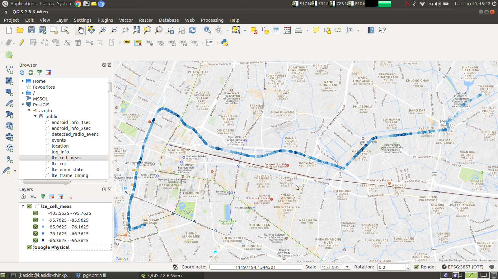
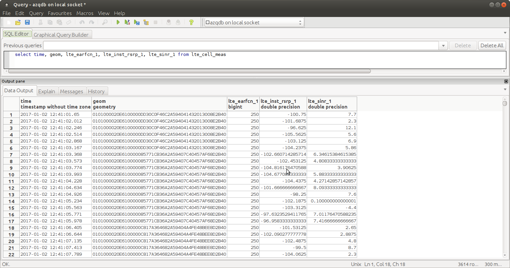
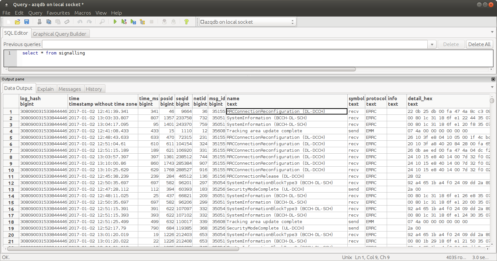

azm_db_merge 
============

Import all LTE/WCDMA/GSM test data (radio parameters, Layer-3 messages, etc) from [AZENQOS Android](http://www.azenqos.com) test logs (.azm files) into [PostgreSQL](https://www.postgresql.org/) for further somewhat 'Big data' radio access network analysis/research/reporting through your own SQL queries and/or with [QGIS](http://www.qgis.org/).

**Some usage screenshots:**

Using [QGIS](http://www.qgis.org/) to plot LTE RSRP from data imported using 'azm_db_merge' into PostgreSQL+PostGIS:

Using pgadmin to query LTE EARFCN, RSRP, SINR and their timestamps along with position in 'geometry POINT format':

Using pgadmin to query Layer-3 messages (the 'info' column contains the decoded L3 message text contents but they are multiline which pgadmin doesn't show - psql can show them though):

For further info on the data structure and how to access the imported data, please see the section **[How to access the imported data](#how-to-access-the-imported-data)** further below.

The current azm_db_merge support for PostgreSQL has full support for all azm_db_merge features:
- auto table create
- if table already exists in server, auto add of coulmns found in .azm to server
- very fast import speed through bulk insert operations. (A 1 hour lte/wcdma drive takes about 10 seconds to import for MSSQL and around 4.3 seconds for PostgreSQL).
- prevent duplicate .azm imports.
- unmerge support.
- merge/unmerge transactions are atomic.

Setup
-----

- Use [git](https://git-scm.com/) to clone this repository:
<pre>git clone https://github.com/freewillfx-azenqos/azm_db_merge.git</pre>

Note: For Windows users, to avoid some 'permission issues' (reported on Windows 10) we recommend to copy/clone to the root of the drive like 'c:\azm_db_merge\' (running 'git clone' at 'c:\' would make the folder there).

- Please follow [SETUP.md](SETUP.md) to setup all requirements/dependencies first then follow the below 'Generic usage' section.

- To update your local 'clone' - you can run:
<pre>git pull</pre>

Generic usage
-------------

Specify --azm_file [file.azm or folder containing multiple .azm files] to import (merge) all data from the 'azqdata.db' sqlite3 database zipped in each azm file into the specified target database.

This operation will CREATE (if requireD), ALTER (if new columns are detected)
and INSERT data from all tables in the 'azqdata.db' of the azm log file into
the target (central) database.

To 'unmerge' (remove all data from target db that cam from this .azm file) simply add --unmerge.

For a the full list of usage and options - please run:
<pre>python azm_db_merge.py --help</pre>

Example commands are provided in .sh files for PostgreSQL and .bat files for MSSQL in sections further below.

Note: For a list of all 'elements' (which form tables through binding to columns) of azm's azqdata.db please refer to:
https://docs.google.com/spreadsheets/d/1ddl-g_qyoMYLF8PMkjrYPrpXusdinTZxsWLQOzJ6xu8/

You need to specify the --target_db_type and its ODBC login settings too.
(for SQLite3 merges - specify all login, password, database as "" - not used).

**A note on the 'logs' table and how to filter tables for each 'azm log':**

After a successful merge, you will have a new row showing the imei, log_start_time and log_endtime of that azm - in the 'logs' table.

All tables have the 'log_hash' column showing 'from which log did this row in this table come from' - you can find further info about the log by finding a row with the matching 'log_hash' in the 'logs' table. The 'log_hash' can also be calculated - it is simply a 64-bit number: the high 32 bits is the "last 9 digits of the imei", the low 32 bits is the "log start time" in the format of "seconds since January 1, 1970".

### PostgreSQL examples:

Please open example GNU/Linux shell script files named below in a text editor:
- merge:
  - [ex_postgre_merge_azm.sh](ex_postgre_merge_azm.sh)
  - [ex_postgre_merge_folder.sh](ex_postgre_merge_folder.sh)
- unmerge:
  - [ex_postgre_unmerge_azm.sh](ex_postgre_unmerge_azm.sh)
  - [ex_postgre_unmerge_folder.sh](ex_postgre_unmerge_folder.sh)
  
---

*Microsoft SQL Server support is now deprecated - we do not support MS SQL Server import anymore as all our new features, servers and azm_db_merge users are on PostgreSQL only.*

---

### SQLite example:

In below example we want to merge the sqlite3 'azqdata.db' files from multiple azm files into a single target sqlite3 file named 'merged.db':

<pre>
python azm_db_merge.py --target_db_type sqlite3 --azm_file azms_to_merge_folder --server_user "" --server_password "" --server_database "" --target_sqlite3_file merged.db
</pre>

(you can also run this cmd again on other azm folders/files to the same "merged.db" - if the merged.db exists it would just 'append' to it - just take care to not import the same azm files again as there are no duplicate checks in sqlite3 mode yet)

Note:
The sqlite3 merge option is very early and still does not have a few features:
  - There are no 'column' checks - no auto ALTER support as in PostgreSQL yet. (so merging of azm files from different app versions might fail - if their tables are different).
  - There is no --unmerge support yet.
  - The are no 'already merged' checks in sqlite3 merge mode yet.

How to access the imported data
-------------------------------

Before we start doing SQL queries (or opening tables in QGIS) with the "merged" (multiple logs) database - please read through the *"Mobile Log (.azm) SQLite3 Database access and data reference"* section and also the *"Parameter List and Sqlite Database structure"* section right after it - in the "AZQ User Guide" to get an understanding about the "events", "messages" and "elements" and their "arguments" (index) - at link below:
https://docs.google.com/document/d/18GZAgcs3jRFdWqfvAqmQicvYlXRk6D0WktqWmd5iwwo/edit#heading=h.6vk8shbpst4

### Easy Data Access and plotting via QGIS

You can use the same method to plot/export using QGIS as mentioned in the topic *Using QGIS to plot and export data (CSV, MIF, TAB, KML) from the azm file’s ‘azqdata.db’* in the link below (please go through this first):
https://docs.google.com/document/d/18GZAgcs3jRFdWqfvAqmQicvYlXRk6D0WktqWmd5iwwo/edit#heading=h.x709kxgmard0

Below we detail a bit about the different connection setup instead of the 'spatialite' connection used in the link above.

#### QGIS Connection: PostgreSQL (+PostGIS)

- In QGIS > Browser Panel > right-click 'PostGIS' > New Connection... and fill in your database info/credentials - example plot:

#### QGIS Connection: merged sqlite3 or original azqdata.db inside each ".azm" file
- You can also use QGIS to directly open the [SQLite](https://sqlite.org/) 'azqdata.db' inside each ".azm" file (without using azm_db_merge - and also query it with any SQLite browser) or the merged sqlite3 database files you merged with azm_db_merge.
- Simply choose 'SpatiaLite' in QGIS's Browser Panel and locate the extracted 'azqdata.db' file you extracted from the azm (simply rename the .azm to .zip and unzip) and the list of populated tables would show up similar to screenshots PostgreSQL QGIS access above.

### Data Access via SQL queries

After going through the document linked in the start of the "How to access the imported data" section above (https://docs.google.com/document/d/18GZAgcs3jRFdWqfvAqmQicvYlXRk6D0WktqWmd5iwwo/edit#heading=h.6vk8shbpst4) please go through some notable excerpts and additional notes listed below:
- The data is structured into "tables" - to know which parameter is in which table - simply open the link below and search for your parameter in the "var_name" column, its table is in the "db_table" column:
https://docs.google.com/spreadsheets/d/1ddl-g_qyoMYLF8PMkjrYPrpXusdinTZxsWLQOzJ6xu8/edit?usp=sharing
- The Layer-3 messages and other signalling like 'SIP' are in their own 'signalling' table.
- The events are in the "events" table.
- The list of all imported logs are in the "logs" table. (the individual sqlit3 db inside each azm also has this table - with normally only one row because it is from one azm log). This table would tell you the log's original ".azm" filename, the log start_time, end_time, app version, tag name (log_tag) etc.
- The table structure of the sqlite3 database and the "merged" target database is essentially the same.
- All tables have the "log_hash" column - this tells you "from which log did this row in this table come from" - you can use it to query the "logs" table for the row that has the same "log_hash" to get further info about the log.
- All tables have the "time" column - this is the timestamp of that row.
- All tables have the "geom" column - this is the "geometry POINT" data blob - simply the Latitude (Y) and Longitude (X) combined in a form that can be queried "spatially" and also direcly usable/plottable by tools like QGIS.
- All tables have the "posid" column (position id) - this coulumn can be used together with the "log_hash" to do "joins" of your target table with the "location" table to get the "positioning_lat" and "positioning_lon" of each row (in case you prefer not to use or not to import the spatial "geom" using azm_db_merge.py's option: --import_geom_column_in_location_table_only).
- All tables have the "seqid" column (sequence id) - this can be used to easily compare between rows regarding which came before/after/between especially in (rare) cases where a few rows have the same timestamp.
- To know the 'span' (start time/seqid, end time/seqid) of a particular script test item (or "session") - you can use the rows of the tables whose names start with 'statement_sum_' - these tables would contain the 'time' and 'seqid' of all the main 'events' that can come from these script test item. For example the table named 'statement_sum_ftp_download' would have the rows of each 'session' that the ftp_download script ran so you can use it to query things like 'lte_l1_dl_throughput_all_carriers' between its column of 'event_20704_ftp_download_first_byte_received_time' and 'event_20705_ftp_download_last_byte_received_time' (or seqid).

Now, you can use you preferred SQL browser or programming language to do some queries on the data as described above. Below are some simple examples:

#### SQL Query simple examples

*Note: Below are very simple easy-to-write examples tested on PostgreSQL via 'pgAdmin III' - not considering efficiency or any advanced SQL techniques.*

Let's say we want to get the average of the "LTE RSRP" param (in dBm) - first we need to know which table it resides in, so we open:
https://docs.google.com/spreadsheets/d/1ddl-g_qyoMYLF8PMkjrYPrpXusdinTZxsWLQOzJ6xu8/edit?usp=sharing
And we search for "rsrp", we can see the row with "var_name" (parameter name) 'lte_inst_rsrp' and its "db_table" column shows that it is in the table 'lte_cell_meas'. Having understood about the "index" we now know that the actual column name would need to have a '_1' suffix if we want to show the PCC (first index) measurements for RSRP - so we can now simply query the database with the SQL below:
<pre>select avg(lte_inst_rsrp_1) from lte_cell_meas</pre>
And we'd get our result shown almost instantly.

Then, let's say we want to know the 'max' RSRP - we can do the following query:
<pre>select max(lte_inst_rsrp_1) from lte_cell_meas</pre>

Suppose we got "-50.6875" as the max RSRP, then, let's say we want to know 'from which log did this 'max' RSRP come from?' - we can then simply query below to get the full row it came from:
<pre>select * from lte_cell_meas where lte_inst_rsrp_1 = -50.6875</pre>

We'd get a row (or a few) then we can see the 'log_hash' of the log. In our case the 'log_hash' is '264179501379092216' - so now we can simply query below to get the log's original file name (log_ori_file_name column), tag (log_tag column) of the log that has this max RSRP:
<pre>select * from logs where log_hash = 264179501379092216</pre>

We now found the log that has is the champion of RSRP! Congratulations!

Some more examples can be checked from the (very simple) example R programming language example project - although this project uses the old/obsolete table and column names and queries the unmerged sqlite3 database, it can still provide an idea of how to find/get and process some radio parameters and Layer-3 messages in the database - it produces some charts below:
- RSRP plot on map
- RSRP distribution histogram
- A histogram showing the distribution of 'e1' WCDMA L3 RRC MeasurementReport's measurement events (e1a, e1b, e1c, etc)
- You can view the example plots and get the source code at:
https://docs.google.com/document/d/18GZAgcs3jRFdWqfvAqmQicvYlXRk6D0WktqWmd5iwwo/edit#heading=h.nnww3d7qok2v

Special Thanks
--------------

- Special thanks to Mike H.C. Pan for his great suggestions and guidance that finally steered us towards initiating this project. We'd also like to greatly thank him for introducing and helping us get started with open-source GIS tools like QGIS, PostGIS and SpatiaLite.

- Thanks to the [Python](http://www.python.org) developers and community for providing this immensely powerful yet easy to lean/use and productive programming language.

- Thanks to the [psycopg2](http://initd.org/psycopg/) project for providing simple, stable, fast PostgreSQL access.

- Thanks to the [pyodbc](https://mkleehammer.github.io/pyodbc/) project for providing simple, stable, fast ODBC (to Microsoft SQL Server) access. (MS SQL Server import support is now deprecated)

- Thanks to [SQLite](https://sqlite.org/) for their fast, light, powerful DBMS.

- Thanks to [PostgreSQL](https://www.postgresql.org/) for their advanced, fast, powerful DBMS.

- Thanks to Microsoft for providing [SQL Server 2014 Developer Edition for FREE](https://blogs.technet.microsoft.com/dataplatforminsider/2016/03/31/microsoft-sql-server-developer-edition-is-now-free/). (MS SQL Server import support is now deprecated)

License
-------

Copyright (C) 2016 Freewill FX Co., Ltd. All rights reserved.

Released under the Apache-2.0 License. Please see [LICENSE](LICENSE) file.

Contact
-------

Please contact support@azenqos.com for further info and other queries.

Authors
-------

- Kasidit Yusuf

