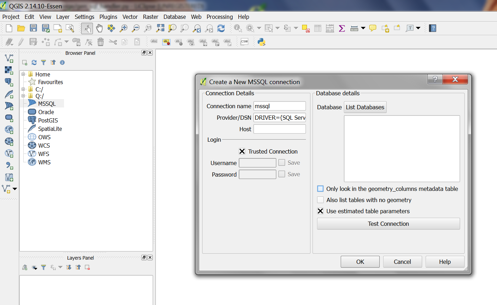
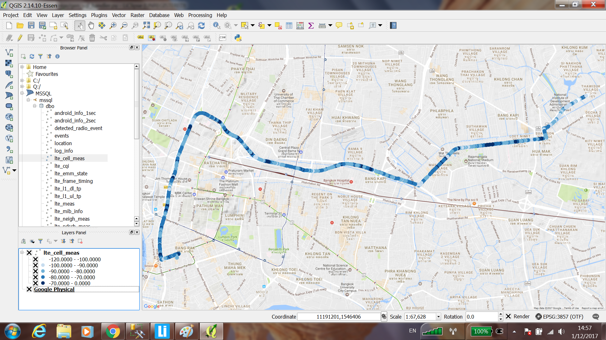

azm_db_merge 
============

Import all LTE/WCDMA/GSM test data (radio parameters, Layer-3 messages, etc) from [AZENQOS Android](http://www.azenqos.com) test logs (.azm files) into [PostgreSQL](https://www.postgresql.org/) or [Microsoft SQL Server](https://www.microsoft.com/en-us/sql-server/) for further Big data radio access network analysis/research/reporting through your own SQL queries and [QGIS](http://www.qgis.org/).

**Some usage screenshots:**

Using [QGIS](http://www.qgis.org/) to plot LTE RSRP from data imported using 'azm_db_merge' into PostgreSQL+PostGIS:

Using pgadmin to query LTE EARFCN, RSRP, SINR and their timestamps along with position in 'geometry POINT format':

Using pgadmin to query Layer-3 messages (the 'info' column contains the decoded L3 message text contents but they are multiline which pgadmin doesn't show - psql can show them though):

**Some basic info on 'azm' files and accessing this data:**
- A ".azm" (azenqos mobile test log) file is simply a renamed zip file so you can open/extract with any zip manager software to view the azqdata.db file with any SQLite3 browser program on PC. (If you don't see this file in your .azm logs, go to AZENQOS app > Settings > Enable Database Logging to enable this feature). For more info on the ".azm" file contents and simple data storage architecture (elements, events, messages) - please see the 'AZQ User Guide' database access section from link below:
https://docs.google.com/document/d/18GZAgcs3jRFdWqfvAqmQicvYlXRk6D0WktqWmd5iwwo/edit#heading=h.6vk8shbpst4
- Required AZENQOS Android app version (shown in top-right corner of main menu) is ver-3.0.587 or newer.
- Some logs are provided in the 'example_logs' folder.
- The full list of the parameters and their tables is available at:
https://docs.google.com/spreadsheets/d/1ddl-g_qyoMYLF8PMkjrYPrpXusdinTZxsWLQOzJ6xu8/edit?usp=sharing
- The Layer-3 messages are in the 'signalling' table and the events are in the 'events' table.

The current azm_db_merge support for PostgreSQL and Microsoft SQL Server implementation (through pyodbc + "SQL Server Natve Client 11.0" ODBC driver)
 has full support for all azm_db_merge features:
- auto table create
- if table already exists in server, auto add of coulmns found in .azm to server
- very fast import speed through bulk insert operations. (A 1 hour lte/wcdma drive takes about 10 seconds to import for MSSQL and around 4.3 seconds for PostgreSQL).
- prevent duplicate .azm imports.
- unmerge support.
- merge/unmerge transactions are atomic.

Setup
-----

- Use [git](https://git-scm.com/) to clone this repository:
<pre>git clone https://github.com/freewillfx-azenqos/azm_db_merge.git</pre>

Note: For Windows users, to avoid some 'permission issues' (reported on Windows 10) we recommend to copy/clone to the root of the drive like 'c:\azm_db_merge\'.

- Please follow [SETUP.md](SETUP.md) to setup all requirements/dependencies first then follow the below 'Generic usage' section.

- To update your local 'clone' - you can run:
<pre>git pull</pre>

Generic usage
-------------

Specify --azm_file <file.azm or folder containing multiple .azm files> to import the .azm's log database to a central Database.

This operation will CREATE (if requireD), ALTER (if new columns are detected)
and INSERT data from all tables in the 'azqdata.db' of the azm log file into
the target (central) database.

To 'unmerge' (remove all data from target db that cam from this .azm file) simply add --unmerge.

For a the full list of usage and options - please run:
<pre>python azm_db_merge.py --help</pre>

Example commands are provided in .sh files for PostgreSQL and .bat files for MSSQL in sections further below.

Note: For a list of all 'elements' (which form tables through binding to columns) of azm's azqdata.db please refer to:
https://docs.google.com/spreadsheets/d/1ddl-g_qyoMYLF8PMkjrYPrpXusdinTZxsWLQOzJ6xu8/

You need to specify the --target_db_type and its ODBC login settings too.
(for SQLite3 merges - specify all login, password, database as "" - not used).

**A note on the 'logs' table and how to filter tables for each 'azm log':**

After a successful merge, you will have a new row showing the imei, log_start_time and log_endtime of that azm - in the 'logs' table.

All tables have the 'log_hash' column showing 'from which log did this row in this table come from' - you can find further info about the log by finding a row with the matching 'log_hash' in the 'logs' table. The 'log_hash' can also be calculated - it is simply a 64-bit number: the high 32 bits is the "last 9 digits of the imei", the low 32 bits is the "log start time" in the format of "seconds since January 1, 1970".

PostgreSQL examples:
--------------------

Please open example GNU/Linux shell script files named below in a text editor:
- merge:
  - [ex_postgre_merge_azm.sh](ex_postgre_merge_azm.sh)
  - [ex_postgre_merge_folder.sh](ex_postgre_merge_folder.sh)
- unmerge:
  - [ex_postgre_unmerge_azm.sh](ex_postgre_unmerge_azm.sh)
  - [ex_postgre_unmerge_folder.sh](ex_postgre_unmerge_folder.sh)
  

Microsoft SQL Server examples:
------------------------------

Please open example Windows bat files named below in a text editor:
- merge:
  - [ex_mssql_import_azm.bat](ex_mssql_import_azm.bat)
  - [ex_mssql_import_azm_folder.bat](ex_mssql_import_azm_folder.bat)
- unmerge:
  - [ex_mssql_remove_azm.bat](ex_mssql_remove_azm.bat)
  - [ex_mssql_remove_azm_folder.bat](ex_mssql_remove_azm_folder.bat)

sqlite3 import/merge .azm example
---------------------------------

In below example we want to merge the sqlite3 'azqdata.db' from multiple azm files into a single sqlite3 file named 'merged.db':

<pre>
python azm_db_merge.py --target_db_type sqlite3 --azm_file azms_to_merge_folder --server_user "" --server_password "" --server_database "" --target_sqlite3_file merged.db
</pre>

(you can also run this cmd again on other azm folders/files to the same "merged.db" - if the merged.db exists it would just 'append' to it - just take care to not import the same azm files again as there are no duplicate checks in sqlite3 mode yet)

Note:
The sqlite3 merge option is very early and still does not have a few features:
  - There are no 'column' checks - no auto ALTER support as in PostgreSQL yet. (so merging of azm files from different app versions might fail - if their tables are different).
  - There is no --unmerge support yet.
  - The are no 'already merged' checks in sqlite3 merge mode yet. 

 
Using QGIS with databases created by azm_db_merge
-------------------------------------------------

*NOTE: You can also use QGIS to directly open the [SQLite](https://sqlite.org/) 'azqdata.db' (and query it with any SQLite browser) in each azm file too (without using azm_db_merge to merge it into a centralized database) - simply choose 'SpatiaLite' in QGIS's Browser Panel and locate the extracted 'azqdata.db' file you extracted from the azm (simply rename the .azm to .zip and unzip).*

**PostgreSQL (+PostGIS)**

- In QGIS > Browser Panel > right-click 'PostGIS' > New Connection... and fill in your database info/credentials - example plot:

**Microsoft SQL Server**

- Make sure you already created the ODBC "Native Client" connection as described in SETUP.md first.

- Try run azm_db_merge to merge/unmerge - check the output for "using connect_str:" like below line:
<pre>using connect_str: DRIVER={SQL Server Native Client 11.0};SERVER=localhost;DATABASE=azqdb;UID=azqdblogin;PWD=pass</pre>
  - This is your 'Provider/DSN' - starting from DRIVER=... so in above case it is: 
    <pre>DRIVER={SQL Server Native Client 11.0};SERVER=localhost;DATABASE=azqdb;UID=azqdblogin;PWD=pass</pre>

- In QGIS > Browser Panel > right-click 'MSSQL' > New Connection...

- Enter "Provider/DSN" copied from your output as mentioned above.

- Uncheck "Only look in geometry_columns metadata table"

- Press 'List Databases' and 'Test Connection'

- Press 'OK'

- Double-click your new connection and wait a few seconds for it to list available tables that have plottable (geometry) columns.

- Double-click on the tables you want to show and customize normally as in QGIS usage - example LTE RSRP plot:

Special Thanks
--------------

- Special thanks to Mike H.C. Pan for his great suggestions and guidance that finally steered us towards initiating this project. We'd also like to greatly thank him for introducing and helping us get started with open-source GIS tools like QGIS, PostGIS and SpatiaLite.

- Thanks to the [Python](http://www.python.org) developers and community for providing this immensely powerful yet easy to lean/use and productive programming language.

- Thanks to the [psycopg2](http://initd.org/psycopg/) project for providing simple, stable, fast PostgreSQL access.

- Thanks to the [pyodbc](https://mkleehammer.github.io/pyodbc/) project for providing simple, stable, fast ODBC (to Microsoft SQL Server) access.

- Thanks to [SQLite](https://sqlite.org/) for their fast, light, powerful DBMS.

- Thanks to [PostgreSQL](https://www.postgresql.org/) for their advanced, fast, powerful DBMS.

- Thanks to Microsoft for providing [SQL Server 2014 Developer Edition for FREE](https://blogs.technet.microsoft.com/dataplatforminsider/2016/03/31/microsoft-sql-server-developer-edition-is-now-free/).

License
-------

Copyright (C) 2016 Freewill FX Co., Ltd. All rights reserved.

Released under the Apache-2.0 License. Please see [LICENSE](LICENSE) file.

Contact
-------

Please contact support@azenqos.com for further info and other queries.

Authors
-------

- Kasidit Yusuf

